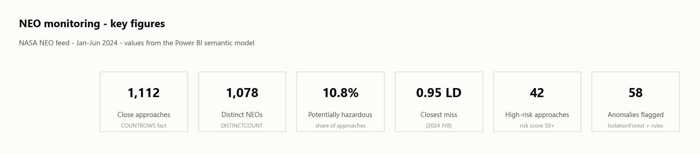
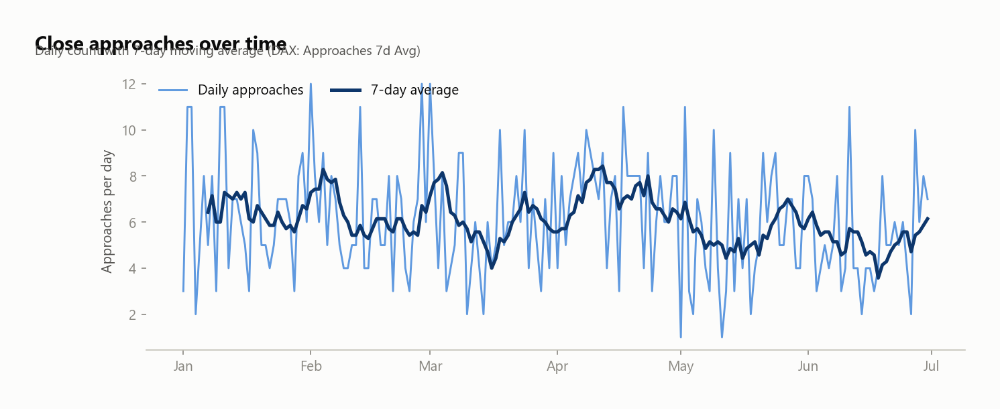
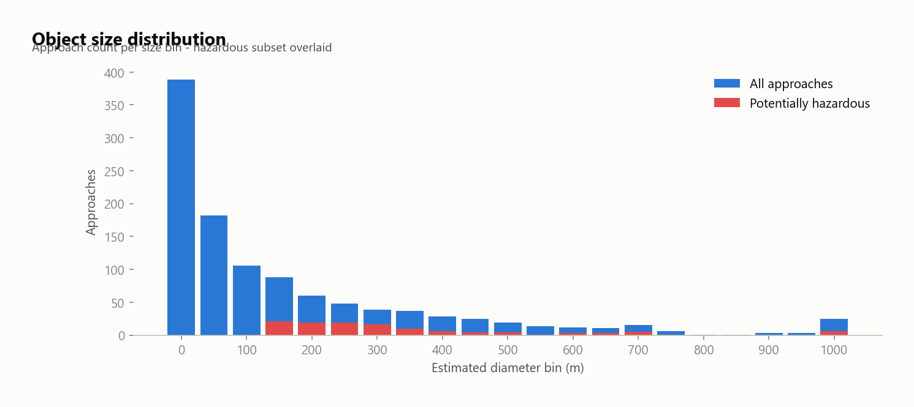
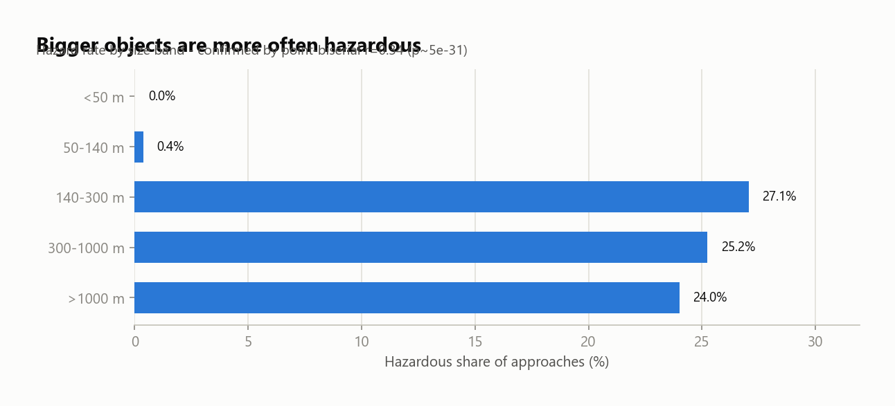
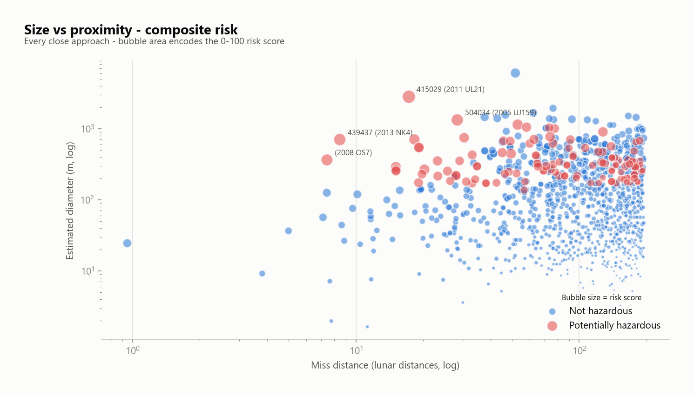
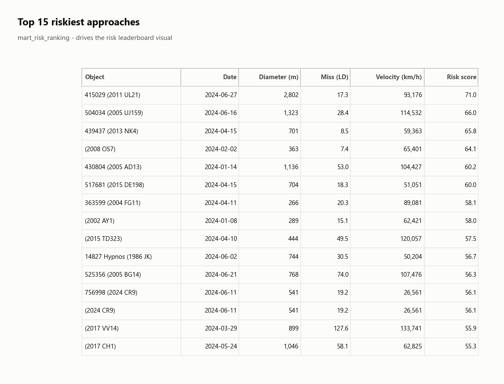
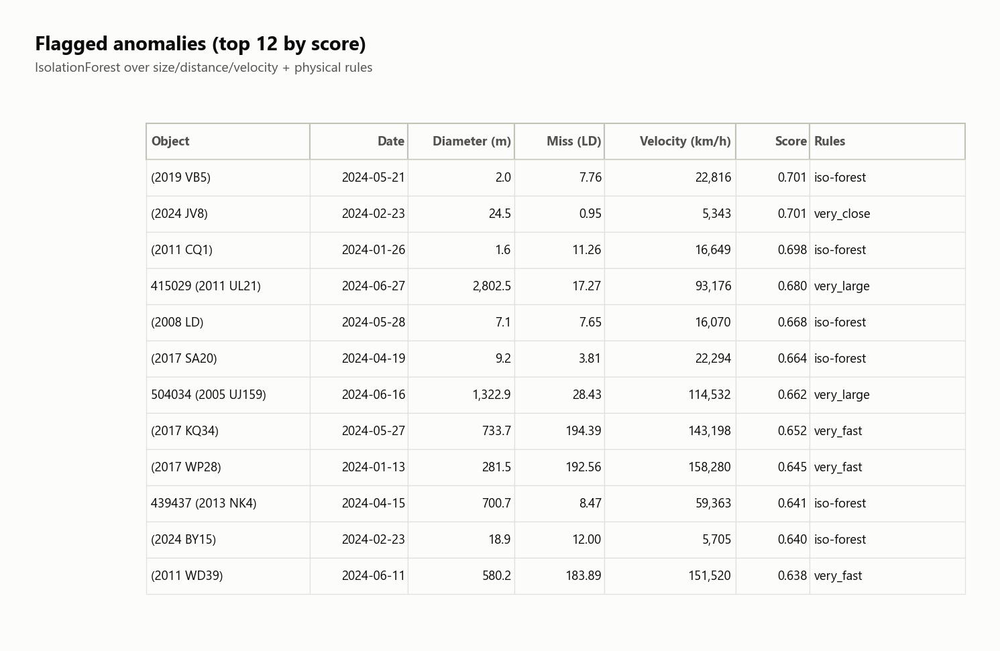
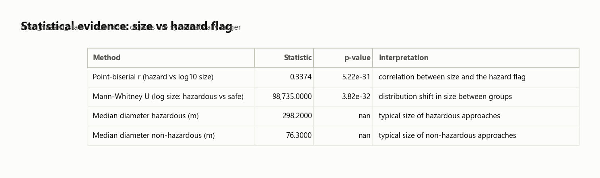

# NASA NEO Risk Platform

An end-to-end data platform over NASA's Near-Earth-Object (NEO) feed. It ingests
close-approach data from the NASA API, cleans and validates it, models a DuckDB
**star schema**, computes a **composite close-approach risk score**, runs a
**size↔hazard statistical test** and **anomaly detection**, and publishes
**BI-ready marts** consumed by a three-page **Power BI report** (star-schema
semantic model, 23 DAX measures; [previews below](#power-bi-dashboard)).

Same engineering backbone as a production analytics service: config-driven,
tested, layered, with data-quality contracts and a clean serving layer.

## Architecture

```
                ┌─────────┐   ┌──────────┐   ┌───────────┐   ┌────────────┐
NASA NEO API ─▶ │ ingest  │─▶ │ staging  │─▶ │ warehouse │─▶ │ BI exports │
(7-day chunks)  │ (bronze)│   │ (silver) │   │  (gold)   │   │ csv/parquet│
                └─────────┘   └────┬─────┘   └─────┬─────┘   │  + duckdb  │
                                   │               │         └────────────┘
                             ┌─────▼─────┐   ┌─────▼──────────────┐
                             │ quality   │   │ analytics          │
                             │ (pandera) │   │ risk · stats ·     │
                             └───────────┘   │ anomaly            │
                                             └────────────────────┘
```

- **Bronze** `data/raw/neo_raw.json`: raw feed responses (or synthetic).
- **Silver** `data/staged/close_approaches.parquet`: one cleaned row per close approach.
- **Gold** `exports/warehouse.duckdb`: star schema + analytics marts.
- **Serving** `exports/bi/`: every table as CSV + Parquet, with a connection guide.

## Data model (star schema)

| table | grain | notes |
| --- | --- | --- |
| `fact_close_approach` | one approach | velocity, miss distance, size, hazard flag |
| `dim_neo` | one object | size, magnitude, sentry/hazard flags |
| `dim_date` | one day | calendar attributes |
| `mart_daily_neo` | day | counts, size, hazard share, closest miss |
| `mart_hazard_summary` | size band | hazard rate by size |
| `mart_size_distribution` | size bin | histogram (hazardous overlay) |
| `mart_monthly_neo` | month | rollup |
| `mart_close_approach_risk` | approach | risk components + score |
| `mart_risk_ranking` | approach | top-100 by risk score |
| `mart_hazard_stats` | test | point-biserial r, Mann-Whitney U |
| `mart_neo_anomalies` | approach | flagged outliers + reasons |

## Quickstart

```bash
uv venv .venv --python 3.12
uv pip install -e ".[dev]"
cp .env.example .env          # add your NASA_API_KEY (DEMO_KEY also works)
source .venv/bin/activate

neoflow run-all               # full pipeline (live API)
neoflow run-all --source synthetic   # fully offline
```

Run any stage on its own: `neoflow ingest|stage|quality|warehouse|risk|stats|anomaly|viz|export`.

Configuration: [`config/settings.yaml`](config/settings.yaml) (date window, risk
weights, …); the API key is read from `.env` (`NASA_API_KEY`) and never logged.

## Analytics

- **Risk score**: each close approach gets a 0-100 score combining size,
  proximity (inverse miss distance), velocity and the hazard flag, with
  configurable weights. Drives `mart_risk_ranking`.
- **Statistics**: point-biserial correlation and Mann-Whitney U test of whether
  hazardous objects are systematically larger (`mart_hazard_stats`).
- **Anomaly detection**: `IsolationForest` over size/distance/velocity plus
  physical rules (very large / very close / very fast).

## Power BI dashboard

A three-page Power BI report sits on top of the serving layer (`exports/bi/`):
the star schema is imported as-is (no transformation logic hidden in the
report), the calendar is a **marked date table**, and all aggregation goes
through **23 documented DAX measures** in display folders: time intelligence
(7-day moving average via `DATESINPERIOD`, MoM % via `DATEADD`), hazard shares
(`REMOVEFILTERS`), `TOPN`-based leaders (`Closest Object`, `Riskiest Object`),
plus a `Risk Band` calculated column (`SWITCH(TRUE(), …)` with a hidden sort
key). Re-run the pipeline and hit **Refresh** to reload everything.

### Page 1: NEO Overview



The headline figures for the Jan-Jun 2024 window, each a DAX measure:
**1,112 close approaches** by **1,078 distinct objects** (`COUNTROWS` /
`DISTINCTCOUNT`), **10.8%** flagged potentially hazardous, and a closest miss
of **0.95 lunar distances**: 2024 JV8 passed *closer than the Moon*. 42
approaches score 50+ on the composite risk scale and 58 are flagged as
anomalies.



Daily approach counts against the 7-day moving average (DAX `DATESINPERIOD`).
Traffic is noisy day-to-day (2-12 approaches) but mean-reverts around ~6 per
day with no drift over the half-year. Spikes are clustering from orbital
geometry, not data problems, so a stable monitoring baseline is reasonable.



The population is heavily right-skewed: sub-50 m objects dominate (~390
approaches) and counts fall quickly with size. The hazardous overlay (red) is
concentrated in the 140-700 m bins and essentially absent below that, which
sets up the next chart.



Hazard rate *steps* from ~0% below 140 m to ~25-27% above, then plateaus
rather than climbing further. That's not a coincidence: 140 m is the size
threshold in NASA's "potentially hazardous" definition, and above it the flag
mostly depends on orbit geometry, so roughly one in four large objects
qualifies, regardless of how much larger it gets.

### Page 2: Risk Explorer



Every approach plotted on log axes (diameter vs miss distance), bubble area =
composite 0-100 risk score, red = hazardous. The biggest bubbles sit where
size meets proximity, and the four labelled objects are exactly the top four
of the leaderboard below, a visual sanity-check that the configurable
size/proximity/velocity/hazard weighting behaves as intended.



**415029 (2011 UL21)** leads at **71/100**: 2.8 km wide, 17.3 LD away at
93,176 km/h. Note the smaller objects ranked right behind it: 439437
(2013 NK4) and (2008 OS7) score 64-66 at just 8.5 / 7.4 LD, showing the score
trades size off against proximity instead of simply ranking the biggest rocks.

### Page 3: Anomalies & Statistics



The review queue: 58 flagged approaches (top 12 shown) with score and the rule
that fired. IsolationForest catches odd feature combinations, while the
physical rules keep flags interpretable: 2024 JV8 trips `very_close`
(0.95 LD), 415029 (2011 UL21) trips `very_large` (2.8 km), and (2017 KQ34)
trips `very_fast` (143,198 km/h).



The size↔hazard question, settled: point-biserial **r = 0.34 (p ≈ 5e-31)** and
Mann-Whitney U (p ≈ 4e-32), with median diameters of **298 m hazardous vs 76 m
non-hazardous**. Hazardous objects are systematically larger; the pattern in
the histogram is real, not sampling noise.

## Data quality

`neoflow quality` validates the full table against a pandera contract and writes
metrics (row counts, null rates, ranges, hazard share, freshness) to
`reports/data_quality/`.

## Tests

```bash
pytest          # synthetic + in-memory, no network
ruff check src
```
